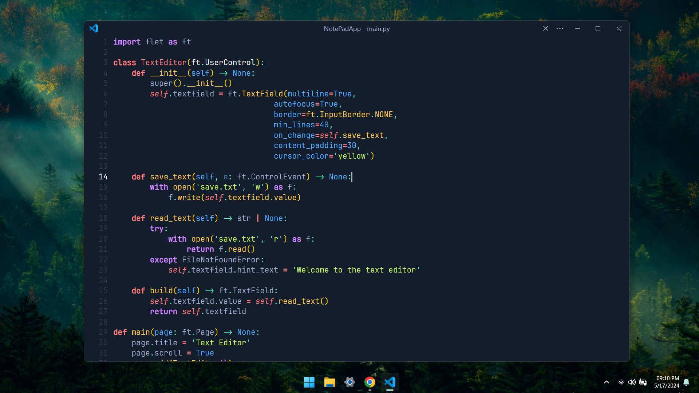
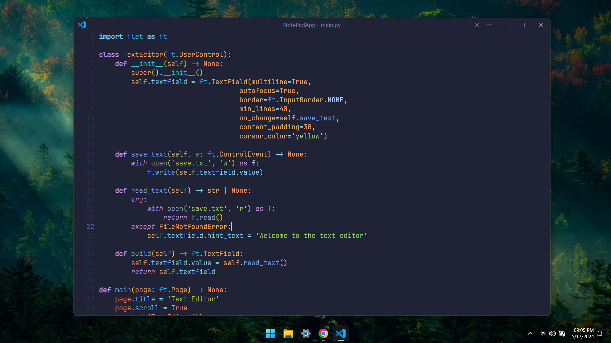
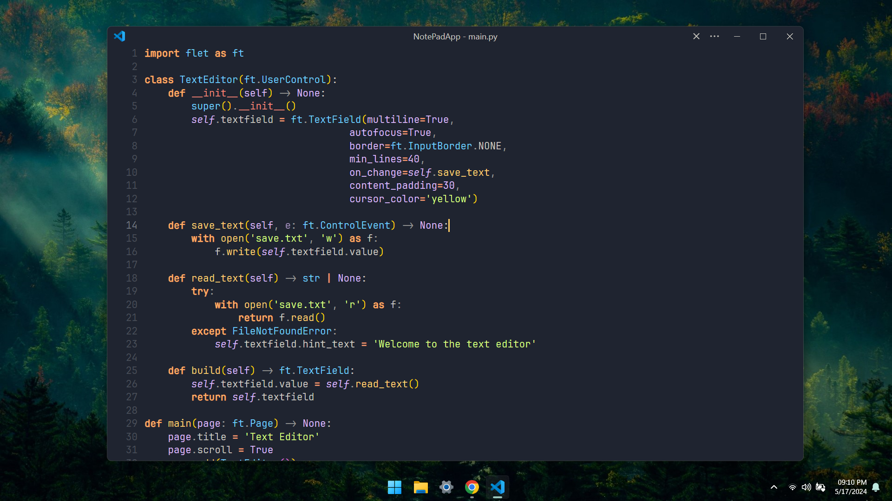
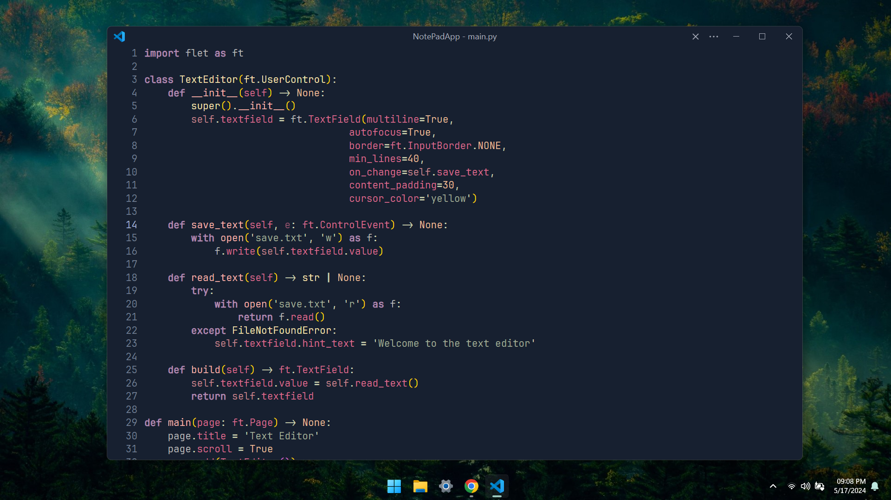
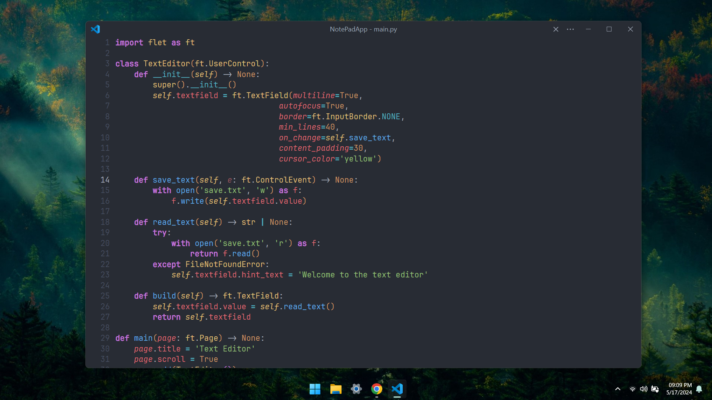

# My Favorite VS Code Color Themes

Hey There! 👋

As developers, we spend countless hours in our text editors, and having the right color theme can make all the difference. A good color theme can not only reduce eye strain but also provide a fresh and stimulating environment that can boost productivity.

## What Makes a Good Color Theme?

A good color theme should:

-   Be easy on the eyes, reducing strain during long coding sessions.
-   Provide clear and distinct syntax highlighting for various code elements.
-   Create a pleasant and motivating environment that enhances focus and productivity.

## My Top VS Code Color Themes

Here are some of the color themes for Visual Studio Code that I personally prefer:

### [Hack The Box](https://marketplace.visualstudio.com/items?itemName=silofy.hackthebox)

A sleek and modern theme inspired by Hack The Box, featuring a dark background with vibrant, contrasting colors.

### [Tokyo Night Frameless](https://marketplace.visualstudio.com/items?itemName=MagdalenaLipka.tokyo-night-frameless)

A minimalist and elegant theme with soothing colors that create a calm coding environment.

### [Ayu](https://marketplace.visualstudio.com/items?itemName=teabyii.ayu)

A simple and beautiful theme with both light and dark variants, providing a balanced and unobtrusive color scheme.

### [Serendipity](https://marketplace.visualstudio.com/items?itemName=wicked-labs.wvsc-serendipity)

A visually appealing theme with a delightful mix of colors that make your code pop without being overwhelming.

### [Rouge](https://marketplace.visualstudio.com/items?itemName=josef.rouge-theme)

A stylish theme with a bold color palette that enhances readability and makes your code stand out.

### [One Dark Pro](https://marketplace.visualstudio.com/items?itemName=zhuangtongfa.Material-theme)

A professional and versatile theme based on Atom's One Dark, offering excellent contrast and a polished look.

Feel free to explore these themes and find the one that best suits your preferences and needs. Happy coding! 🚀
